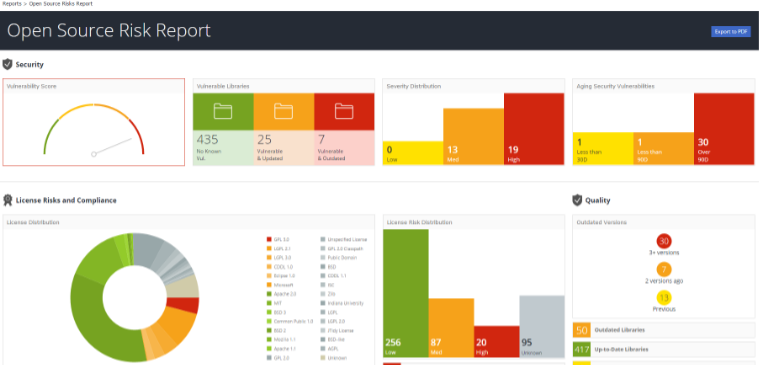
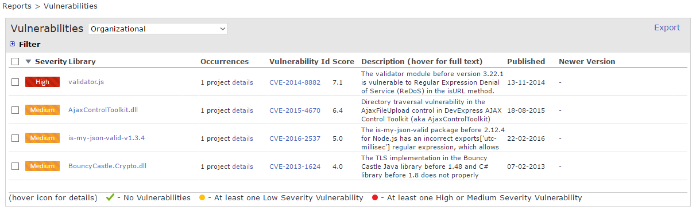
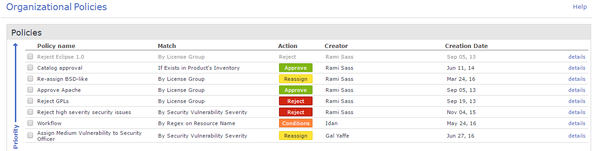
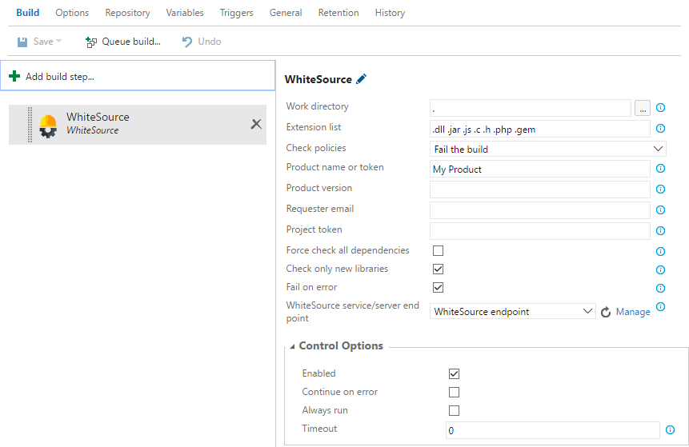

This plugin integrates with your Team Foundation Server (TFS) to automatically detect all open source components, including dependencies, in your products. WhiteSource also alerts in real-time on security vulnerabilities, severe software bugs and problematic open source licenses, so you can find and fix issues as early as possible in your software development process.

[Learn more](http://www.whitesourcesoftware.com/tfs_security/) about our free trial offering. This integration is available for both on premise and SaaS customers.

### WhiteSource Secures Your Open Source Usage

WhiteSource integrates with your CI servers, build tools and repositories to detect all open source components in your software, without ever scanning your code. It provides you with real-time alerts on vulnerable or problematic components, generates comprehensive up-to-date reports in one-click and enables you to streamline your entire open source management process with automated policies.

### Get Real-Time Alerts on Security Vulnerabilities
WhiteSource will alert you in real-time whenever a vulnerable open source component is added to your build or when a vulnerability is discovered in a component already used in your software. You will also be alerted on severe software bugs, problematic licenses (according to your pre-defined policies), new versions and available fixes.

### Shift Left Your Open Source Management
WhiteSource integrates with your GitHub repository and JFrog Artifactory to detect all problematic open source components as soon as they’re added, so you can find and fix issues even before you run a build.

WhiteSource also offers a browser plug-in which displays information on open source components, while you’re searching online repositories (like NuGet). This tool helps developers choose better components by displaying license information, quality rating, and security vulnerabilities, while also showing whether it meets their company’s policy before they even download it. 

### Automated Your Open Source Approval Process
Define your company’s open source policy to automatically approve, reject or ask for approval, on the basis of each component’s license, vulnerabilities, severe software bugs, # of newer versions and more

### Generate Comprehensive Reports in One-Click
WhiteSource analyzes your open source usage every time you run your build. Therefore, in one click you can generate a full and accurate inventory report based on your last build. There is a wide range of additional automated reports like security vulnerability, software bugs, due diligence and many more. All reports can be exported and shares with other teams in your organization.

### Quick Steps to Get Started
1. First, you will need to open a WhiteSource account. [Click here](http://www.whitesourcesoftware.com/trial3/) to start a free trial.
2. Install the extension.
3. Go to the integrate tab in your WhiteSource account and copy the API key. Then open your Team Services project settings page, and click the 'services' tab.
4. Click 'New Service Endpoint' and choose WhiteSource. You should see this screen:

5. Name your connection, add the URL, and paste your API token here and hit 'ok'.
6. Now add the WhiteSource build task to your build definition and fill in the remaining fields to configure it:

7. Run your build.

Please see [our documentation](http://docs.whitesourcesoftware.com/display/serviceDocs/Microsoft+TFS+Integration) for system requirements and configuration instructions.

